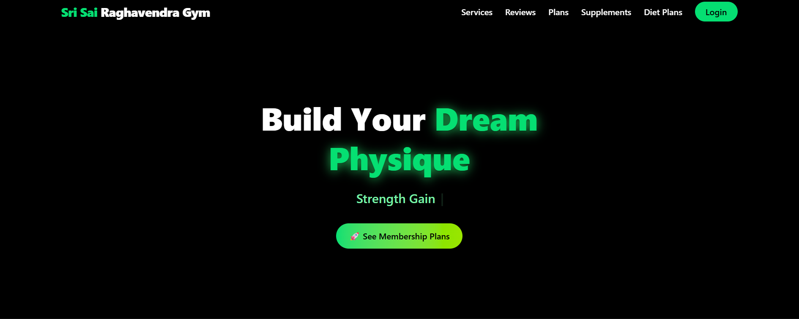

# 🏋️ Advanced Gym Management System

A complete **MERN stack Gym Management System** with integrated **payment gateway** and database support.  
This project simplifies membership handling, service management, and payment processing for both gym owners and users.  

---

## 🚀 Live Demo
🔗 [Click here to view the Gym Management System](https://gym-ivory-kappa.vercel.app/)

---

## ✨ Features
- User-friendly interface to explore gym services and plans.  
- Secure **user authentication** (sign up / login).  
- Membership management with **MongoDB database**.  
- Integrated **payment gateway** for membership plans.  
- Ability for members to **download digital receipts** after payment.  
- CRUD operations: Add, update, or delete plans and user details.  
- Fully **responsive design** for mobile and desktop.  

---

## 🛠️ Technologies Used
- **Frontend**: React.js, Tailwind CSS, JavaScript (ES6+)  
- **Backend**: Node.js, Express.js  
- **Database**: MongoDB (Mongoose ORM)  
- **Payment Integration**: Razorpay (or Stripe, based on your setup)  
- **Hosting**: Vercel (frontend) + Render/Heroku (backend if deployed)  

---

## 📷 Screenshots

---

## 📌 Project Status
✅ Completed with full-stack functionality: frontend, backend, database, and payment gateway integration.  
✨ Future updates may include:  
- Supplement store and diet plans.  
- Admin dashboard for advanced reports.  
- More analytics on user payments and growth.  

---
